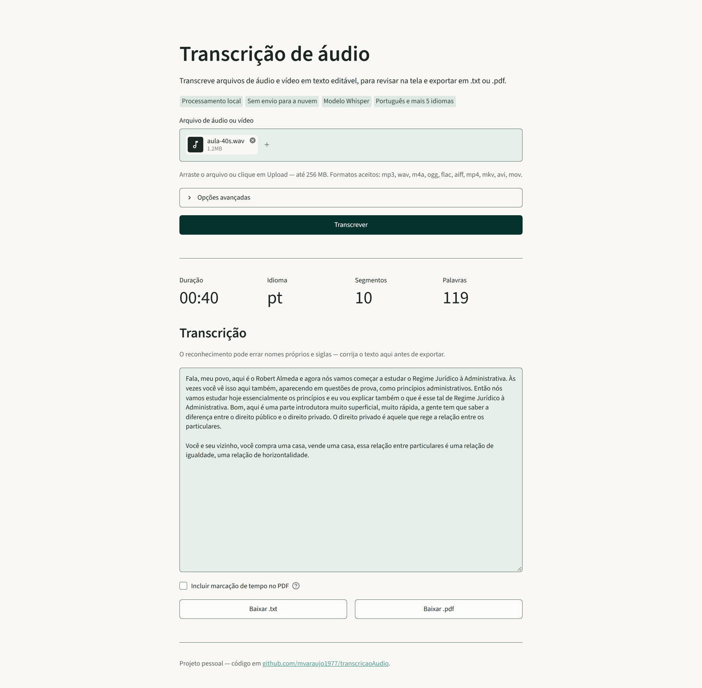
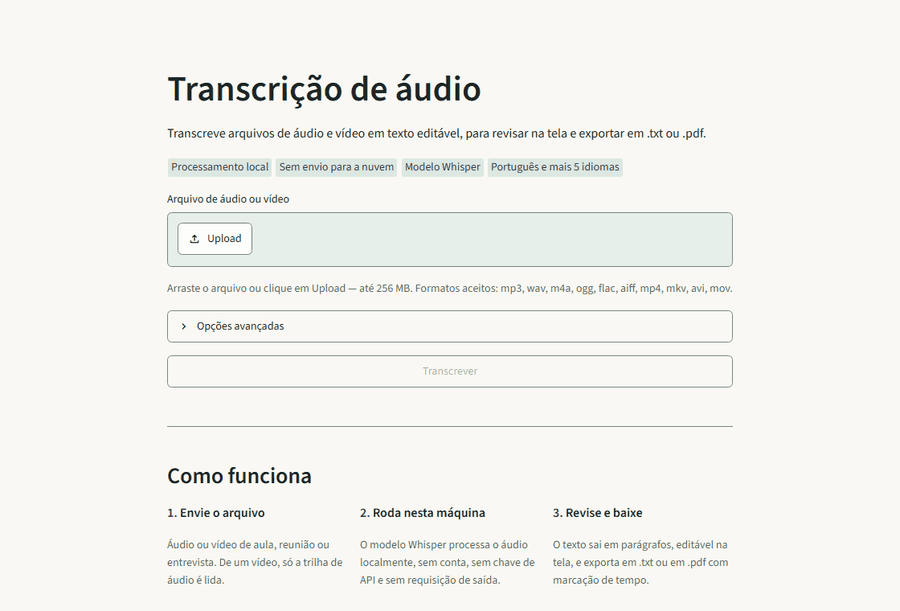

# Transcrição de Áudio

Transcreve arquivos de áudio e vídeo para texto **na própria máquina**, com
revisão na tela e exportação em `.txt` e `.pdf`.

**[Demo ao vivo](https://huggingface.co/spaces/mvaraujo1977/transcricao-audio)**
· [Código](https://github.com/mvaraujo1977/transcricaoAudio)

> A demo roda no plano gratuito do Hugging Face Spaces e **hiberna depois de um
> tempo sem uso**: a primeira visita pode levar cerca de um minuto para acordar —
> não está quebrada. Lá os limites são menores que os locais (5 min de áudio,
> 50 MB, modelo `base`), porque a CPU é compartilhada. Sem arquivo à mão, o botão
> **Testar com exemplo** transcreve um clipe de 24 s em domínio público.



## O que faz

- **Aceita áudio e vídeo** em 10 formatos: `mp3`, `wav`, `m4a`, `ogg`, `flac`,
  `aiff`, `mp4`, `mkv`, `avi`, `mov`. De um vídeo, só a trilha de áudio é lida.
- **Transcreve localmente**, com o Whisper via `faster-whisper`. Nenhum arquivo
  sai da máquina: não há conta, chave de API nem requisição de saída, e o modelo
  vem embutido na imagem Docker.
- **Transcreve, não traduz.** O texto sai no idioma falado no áudio. A lista de
  idiomas serve para dizer ao modelo o que esperar, não para converter de um
  idioma a outro: são 7 opções cobrindo 6 idiomas — português (Brasil e
  Portugal), inglês, espanhol, francês, italiano e alemão —, mais **detectar
  automaticamente**, que deixa o Whisper identificar o idioma sozinho.
- **Devolve texto pontuado**, com capitalização e quebrado em parágrafos de
  ~500 caracteres fechados em pontuação forte — não um bloco corrido.
- **Permite revisar na tela** antes de exportar: o texto vem num campo editável,
  para corrigir nomes próprios e siglas que o reconhecimento errou.
- **Exporta `.txt` e `.pdf`**, com marcação de tempo `[MM:SS]` por parágrafo
  opcional no PDF, para voltar ao ponto exato do áudio.
- **Aceita vocabulário do domínio** (siglas e jargão) para semear o
  reconhecimento e corrigir termos que o modelo erraria por não esperá-los.
- **Cancela no meio** e mantém o que já foi transcrito, com aviso de até que
  ponto do áudio o texto vai.
- **Tem linha de comando** além da interface, com os mesmos parâmetros.
- **Traz um áudio de exemplo**: o botão *Testar com exemplo* transcreve 24 s de
  "O Alienista", de Machado de Assis, em domínio público, sem precisar de
  arquivo à mão ([créditos](exemplos/CREDITOS.md)).

O fluxo completo, do envio ao download, com um áudio de 40 s — quadros do
processo, não em tempo real:



## Tecnologias

| Ferramenta | Papel no projeto |
|---|---|
| **Python 3.12** | linguagem do motor, da interface e da CLI (a imagem roda 3.12; o venv local aceita 3.12+) |
| **faster-whisper** | motor de reconhecimento de fala: recebe o áudio decodificado e devolve segmentos com texto, tempo e idioma detectado |
| **CTranslate2** | runtime que executa o modelo Whisper em CPU, com quantização `int8` — é o que torna viável transcrever sem GPU |
| **PyAV** | decodificação de mídia (liga nos codecs do FFmpeg): lê mp3, mp4, mkv e afins sem depender de um `ffmpeg` instalado no sistema |
| **NumPy** | o áudio decodificado vira um array float32 16 kHz mono, que é o formato que o modelo consome |
| **Streamlit** | interface web: uploader, painel de progresso, texto editável e downloads |
| **ReportLab** | geração do PDF a partir do texto revisado, com cabeçalho e paginação |
| **Docker + Docker Compose** | empacotamento com o modelo já dentro da imagem, porta publicada só no loopback e um comando para subir |

## Como rodar

### Sem instalar nada

A [demo pública](https://huggingface.co/spaces/mvaraujo1977/transcricao-audio)
roda a mesma transcrição, com os limites de demo descritos acima.

### Com Docker (mais fácil)

```bash
docker compose up -d
```

A interface abre em <http://localhost:8501>. O modelo `small` já vem na imagem,
então a primeira transcrição não espera download nenhum e o container funciona
sem rede.

```bash
docker compose logs -f     # acompanhar
docker compose down        # derrubar
```

A porta é publicada em `127.0.0.1:8501:8501`, ou seja, **a tela só abre na
própria máquina** — a aplicação não tem autenticação. Para alcançá-la de outro
aparelho, o caminho seguro é um túnel SSH
(`ssh -L 8501:127.0.0.1:8501 usuario@maquina`); as alternativas e o que cada uma
expõe estão em [docs/SEGURANCA.md](docs/SEGURANCA.md#acesso-pela-rede).

### Sem Docker

Requer Python 3.12+. Não é preciso ter ffmpeg instalado: o PyAV traz os próprios
codecs.

```bash
python -m venv .venv
.venv\Scripts\Activate.ps1        # Linux/macOS: source .venv/bin/activate
pip install -r requirements.txt
streamlit run app.py
```

Na primeira execução fora do Docker, o modelo escolhido é baixado para o cache do
Hugging Face (`~/.cache/huggingface`) — são centenas de MB.

`requirements.txt` declara as dependências diretas com pisos de versão. A imagem
instala `requirements.lock.txt`, com as 51 versões exatas já testadas; o porquê e
o comando de regeneração estão em [docs/SEGURANCA.md](docs/SEGURANCA.md).

### Configuração por variável de ambiente

A mesma imagem serve uma instalação pessoal e uma demo pública: o que muda entre
as duas sai do ambiente, sem tocar no código.

| Variável | Para quê | Padrão |
|---|---|---|
| `TRANSCRICAO_MODELO` | modelo pré-selecionado na tela e na CLI | `small` |
| `TRANSCRICAO_MAX_HORAS` | teto de duração do áudio, em horas | `4` |
| `TRANSCRICAO_MAX_MINUTOS` | o mesmo teto em minutos; tem precedência sobre o anterior | — |
| `TRANSCRICAO_MAX_UPLOAD_MB` | teto de tamanho do arquivo enviado | `256` |

No `docker-compose.yml`, por exemplo:

```yaml
    environment:
      - TRANSCRICAO_MODELO=medium
      - TRANSCRICAO_MAX_HORAS=8
```

## Como usar

### Na tela

1. Envie o arquivo de áudio ou vídeo (até 256 MB no container).
2. Se quiser, abra **Opções avançadas** para escolher idioma, modelo e o
   vocabulário do domínio.
3. Clique em **Transcrever**. O painel mostra a fase (preparo ou transcrição), o
   tempo decorrido, a posição no áudio e a estimativa do que falta, calculada
   pelo ritmo observado na execução. Dá para cancelar a qualquer momento.
4. Revise o texto no campo editável e baixe em `.txt` ou `.pdf`.

Os três estados da tela, o mecanismo do cancelamento e a paleta (com as razões de
contraste medidas) estão em [docs/INTERFACE.md](docs/INTERFACE.md).

### Na linha de comando

```bash
python audioTranscricao.py aula.mp3
python audioTranscricao.py reuniao.mp4 -o ata.txt -l en-US -m medium
python audioTranscricao.py entrevista.m4a -v "LIMPE, impessoalidade, RDC"
```

| Argumento | Descrição | Padrão |
|---|---|---|
| `entrada` | arquivo de áudio ou vídeo | `audio1.wav` ao lado do script |
| `-o`, `--saida` | arquivo `.txt` de saída | `transcricao_audio.txt` |
| `-l`, `--idioma` | idioma do áudio (`en-US`, `es-ES`, ...); vazio deixa detectar | `pt-BR` |
| `-m`, `--modelo` | `tiny`, `base`, `small`, `medium`, `large-v3` | `small` |
| `-v`, `--vocabulario` | termos e siglas do domínio | nenhum |
| `--max-horas` | teto de duração do áudio, em horas | `4` |
| `--sem-limite` | desliga o teto (só para arquivo de origem confiável) | desligado |

Sai com código 1 em caso de erro.

Dentro do container, a pasta `./dados` do projeto é montada em `/app/dados`:

```bash
docker compose run --rm transcricao \
  python audioTranscricao.py dados/aula.mp3 -o dados/aula.txt
```

### Qual modelo escolher

| Modelo | Download | Precisão | Velocidade |
|---|---|---|---|
| `tiny` | ~75 MB | baixa | muito rápida |
| `base` | ~145 MB | razoável | rápida |
| `small` (padrão) | ~480 MB | boa | ~1,6x o tempo real em CPU |
| `medium` | ~1,5 GB | alta | várias vezes mais lenta |
| `large-v3` | ~3 GB | melhor | mais lenta ainda |

Modelos maiores acertam mais jargão, siglas e nomes próprios. Se termos do seu
domínio saírem errados, subir de `small` para `medium` costuma resolver.

## Decisões técnicas

**Duas telas, um motor.** A versão local é o `app.py` (Streamlit) e a demo
pública é o `app_gradio.py` (Gradio) — porque a conta gratuita do Spaces não
libera o SDK Docker, que é como a imagem deste repositório roda. As duas telas
chamam a mesma `transcrever()` de `audioTranscricao.py`: nenhuma reimplementa
decodificação, teto de duração ou pós-processamento. O que muda entre as duas
instalações sai de variável de ambiente, não de código duplicado.

**Reconhecimento local em vez da API do Google.** A primeira versão usava o
Google Speech Recognition e devolvia texto corrido, sem pontuação. Os dois
motores transcreveram a **mesma aula de 37 minutos**, medida com o
`verificar_transcricao.py`. Em densidade, que é o que permite comparar textos de
tamanhos diferentes:

| Motor | Pontos finais / mil palavras | Vírgulas / mil palavras | Medido em |
|---|---|---|---|
| Google Speech Recognition | **0,4** | **0** | 2 e 0 em 4.979 palavras |
| faster-whisper (`small`) | **66,6** | **82,3** | 338 e 418 em 5.078 palavras |

Um bloco de texto sem pontuação é inútil para consulta — não dá para achar um
trecho nem para ler em diagonal. Junto vieram capitalização, timestamps por
segmento e a independência de rede e de serviço externo.

**`temperature=0.0`, para a transcrição ser reprodutível.** O padrão do
faster-whisper reprocessa com amostragem (temperatura de 0,0 a 1,0) os segmentos
que estouram os limiares de `compression_ratio` ou `log_prob`. Duas execuções do
mesmo áudio divergiam em dezenas de palavras e chegaram a perder um item de uma
enumeração. Com temperatura fixa em zero o segmento difícil sai pior, mas sai
igual toda vez — e aí a diferença entre duas transcrições é atribuível ao que
mudou de fato (modelo, vocabulário, pré-processamento), não ao sorteio.

**Decodificação própria com PyAV, em vez do `decode_audio` da biblioteca.** O
tamanho do arquivo não diz quanta memória ele custa: um Opus de 2,7 MB com 2 h de
áudio vira 461 MB de float32 — amplificação de 170x — e o `decode_audio`
decodifica tudo de uma vez antes de qualquer verificação. `decodificar_audio`
conta as amostras enquanto decodifica e aborta ao passar do teto
(`TRANSCRICAO_MAX_HORAS`, 4 h por padrão). Medido nesse arquivo com o teto em
1 h: pico de **216 MB** contra **1.209 MB** do decode completo. O detalhe está em
[docs/SEGURANCA.md](docs/SEGURANCA.md).

**`vad_filter` ligado.** O detector de voz pula os trechos de silêncio, o que
acelera a transcrição e evita o modo de falha do Whisper de repetir a mesma frase
em loop em áudio mudo.

## Segurança

A aplicação recebe um único dado de origem não confiável — o arquivo de mídia — e
o entrega a um decodificador binário. A auditoria feita contra esse cenário está
em **[docs/SEGURANCA.md](docs/SEGURANCA.md)**. Em resumo:

- **Bomba de descompressão**: dois portões contra áudio que custa muito mais
  memória do que o tamanho do arquivo sugere — uma sonda do cabeçalho, que recusa
  em milissegundos, e a contagem de amostras durante a decodificação, que não
  confia em metadado nenhum.
- **Porta só no loopback**: `127.0.0.1:8501:8501` no `docker-compose.yml`, porque
  não há autenticação. Para acesso remoto legítimo, túnel SSH.
- **Build reproduzível**: a imagem instala o lockfile com versões exatas, gerado
  dentro da própria imagem de destino.
- **Arquivo enviado**: extensão vinda de lista branca, nome do upload nunca vira
  caminho, temporário apagado em `finally` e varredura de órfãos na inicialização.
- Também estão documentados os pontos **verificados e corretos** (path traversal,
  `Content-Disposition`, escape do ReportLab, XSRF, usuário não-root) e as
  limitações abaixo.

## Limitações conhecidas

- **Não há autenticação.** Quem alcança a porta tem acesso completo: envia
  arquivos, consome a CPU e lê as transcrições da sessão. A proteção é o binding
  em loopback, e nada além disso. Trocar `127.0.0.1:8501:8501` por `8501:8501`
  remove a única barreira que existe.
- **O `pip-audit` não enxerga as CVEs do FFmpeg embutido no PyAV.** O pacote `av`
  traz os próprios codecs como binários compilados, e é exatamente ele que recebe
  a mídia não confiável — a maior superfície de parsing binário do projeto. O
  `pip-audit` verifica a versão do pacote Python, não o FFmpeg que está dentro
  dele, então uma CVE de decodificador não aparece em varredura de dependências.
  Acompanhar isso exige seguir os avisos de segurança do próprio FFmpeg e subir a
  versão do `av` quando saírem.
- **O lock fixa versões, mas não grava hashes.** `requirements.lock.txt` é um
  `pip freeze`: torna o build reproduzível em termos de *versão*, não de
  *artefato*. Um pacote substituído no índice mantendo o mesmo número de versão
  ainda passaria. Fechar isso exigiria um lock com hashes
  (`pip-compile --generate-hashes`) instalado com `pip install --require-hashes`.
- **A transcrição ocupa uma execução por vez.** O Streamlit roda o script numa
  thread só: enquanto um áudio é transcrito, aquela sessão fica ocupada. É
  suficiente para uso pessoal, que é o caso de uso do projeto.

## Estrutura do repositório

| Arquivo | Papel |
|---|---|
| `app.py` | interface Streamlit (versão local) |
| `app_gradio.py` | interface Gradio (a demo pública); mesma função `transcrever` |
| `audioTranscricao.py` | motor de transcrição e CLI |
| `gerar_pdf.py` | exportação do texto revisado em PDF |
| `.streamlit/config.toml` | tema da interface (paleta, fonte, bordas) |
| `verificar_transcricao.py` | métricas de qualidade de uma transcrição (pontuação, jargão, repetição em loop) |
| `verificar_layout.py` | carrega a tela nos três estados e no cancelamento, com o AppTest |
| `Dockerfile`, `docker-compose.yml` | imagem com o modelo embutido e porta em loopback |
| `exemplos/` | áudio de exemplo em domínio público e seus [créditos](exemplos/CREDITOS.md) |
| `deploy/` | README e dependências do Space, e o script que publica a demo |
| `docs/` | [segurança](docs/SEGURANCA.md) e [interface](docs/INTERFACE.md) em detalhe |

## Licença

[MIT](LICENSE) — uso, cópia, modificação e redistribuição liberados, mantendo o
aviso de copyright e sem garantia.

A licença cobre o código deste repositório. As dependências têm as suas próprias,
conforme os metadados dos pacotes instalados: `faster-whisper` e CTranslate2 são
MIT, Streamlit é Apache 2.0, PyAV, NumPy e ReportLab são BSD, e os pesos do
Whisper, da OpenAI, são MIT.

Uma ressalva prática: o PyAV empacota binários do FFmpeg, que é LGPL (ou GPL,
conforme a build). Distribuir a **imagem Docker pronta** é redistribuir esses
binários, então convém conferir as condições do FFmpeg antes de publicá-la —
rodar localmente, que é o caso deste projeto, não esbarra nisso.
